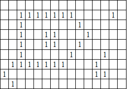

FACULDADE DE CIÊNCIAS ECONÔMICAS E CONTÁBEIS DE B.H.
F U M E C
CURSO CIÊNCIA DA COMPUTAÇÃO
ESTRUTURAS DE DADOS II
Professor: Flávio Velloso Laper
Atividade Auto-instrucional (Parte 1) – Turma 4NA

Feito por: Gabriel Alves Silva

**Instruções:** Esta é um trabalho para análise de imagens de zonas rurais geradas por satélite. Uma imagem é capturada com uma câmara sensível à radiação infravermelha, que diferencia áreas construídas e áreas não construídas. Ao ser digitalizada, a imagem é dividida em um quadriculado de células com M linhas e N colunas. Na imagem digitalizada, células que não contêm qualquer construção recebem o código numérico 0. Células que contêm algum material de construção são representadas por um código numérico 1.

As construções não se sobrepõem na imagem, e construções distintas são separadas por uma distância de pelo menos o tamanho de uma célula. Desta maneira, uma célula com código 1 (marcada) pertence a uma única construção, e células marcadas adjacentes pertencem à mesma construção. Células adjacentes são vizinhas imediatas nas direções vertical, horizontal ou diagonal. Uma construção pode ser circundada por outra, tal como mostrado na figura abaixo; nesse caso, as construções devem ser consideradas distintas (a figura possui quatro construções).

**Tarefa:** Sua função será escrever um programa que, dado um arquivo contendo uma imagem de satélite digitalizada, faça a montagem da imagem e verifique a quantidade de construções contidas na área.

**Entrada de Dados:** uma imagem está armazenada em um arquivo texto cujo nome deve será informado ao programa como um argumento da linha de comando. A primeira linha do arquivo contém dois inteiros positivos, M e N, separados por espaços, que indicam, respectivamente, o número de linhas e o de colunas da imagem a analisar. As M linhas seguintes contêm N dígitos cada (separados por espaços) correspondendo à imagem enviada pelo satélite. Por exemplo, a imagem acima estaria codificada em um arquivo com o seguinte conteúdo:

9 15
0 0 0 0 0 0 0 0 0 0 0 0 0 0 0
0 0 1 1 1 1 1 1 1 0 0 0 0 1 0
0 0 1 0 0 0 0 0 0 1 0 0 0 0 0
0 0 1 0 0 1 1 0 0 0 1 0 0 0 0
0 0 1 0 0 1 1 0 0 1 0 0 0 0 0
0 0 1 0 0 0 0 0 1 0 0 0 1 0 0
0 1 1 1 1 1 1 1 0 0 0 1 0 0 0
1 0 0 0 0 0 0 0 0 0 0 1 1 0 0
0 1 0 0 0 0 0 0 0 0 0 0 0 0 0

O programa deverá se chamar _satelite.exe_ e ter a seguinte utilização:

        **satelite <imagem>**

onde **&lt;imagem&gt;** é o nome de um arquivo contendo uma imagem, tal como descrito acima.

**Saída:** O programa deve calcular o número de células da imagem, alocá-la dinamicamente em memória e contar o número construções contidas na área. Por exemplo, se a imagem acima estiver em um arquivo denominado **exemplo.txt** , a execução do programa com a seguinte linha de comando:

        **c:\>satelite exemplo.txt**

deverá retornar a seguinte saída:

 Examinando imagem exemplo.txt

 Número de células da imagem: 135

 Número de construções: 4

Quando chamado sem argumento algum, as seguintes informações deverão ser exibidas:

        **c:\>satélite**

 Utilização: satélite &lt;imagem&gt;

  &lt;imagem&gt;: nome do arquivo contendo a imagem

A mesma mensagem deve ser exibida se qualquer erro de consistência (nos parâmetros de linha de comando ou no conteúdo do arquivo) for encontrado.